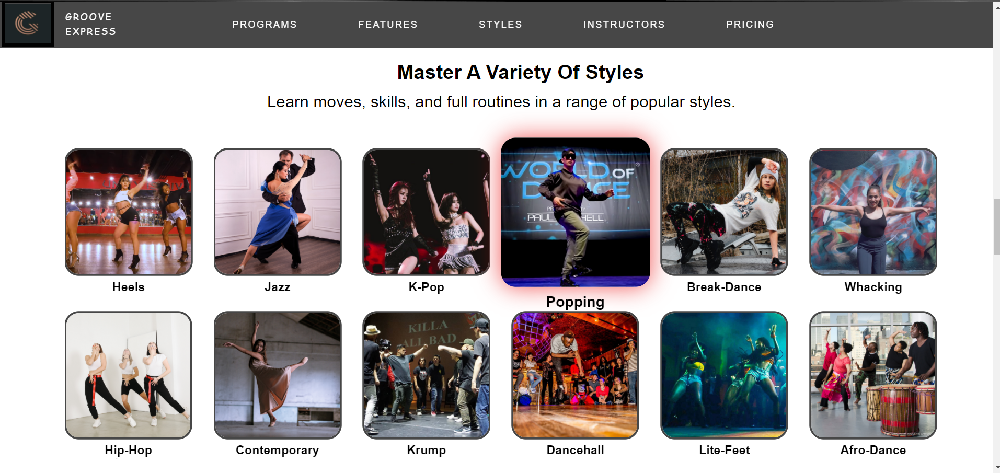
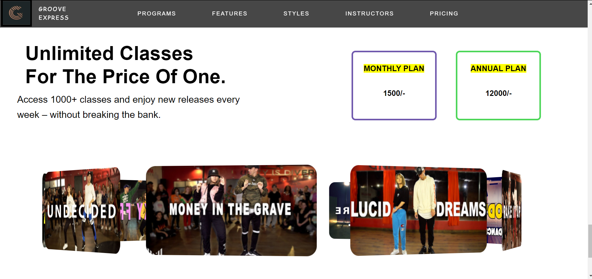
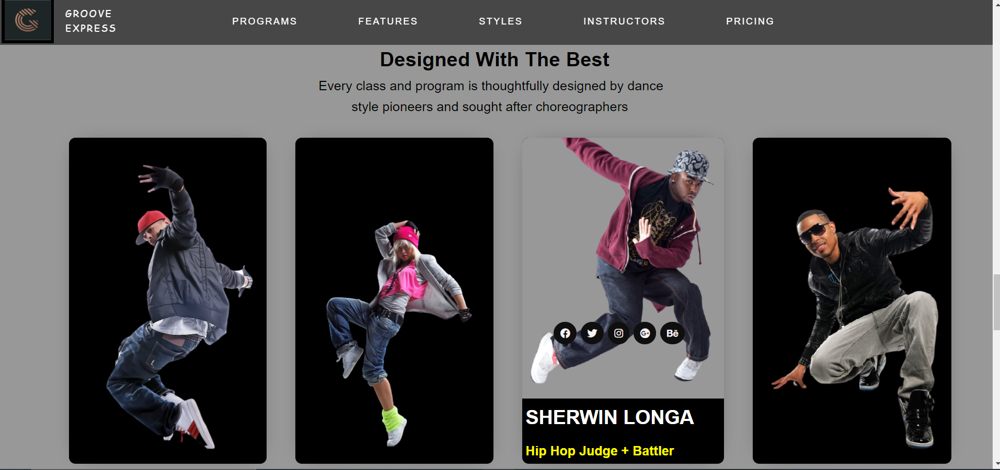
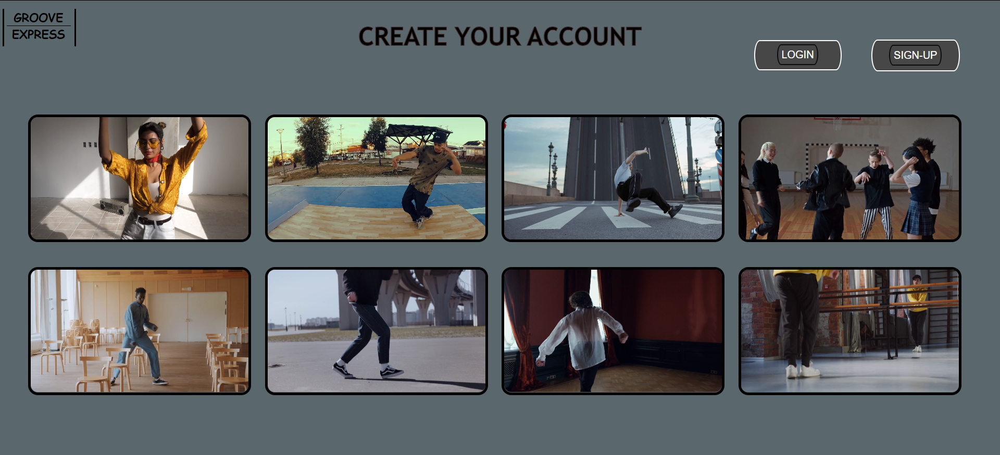
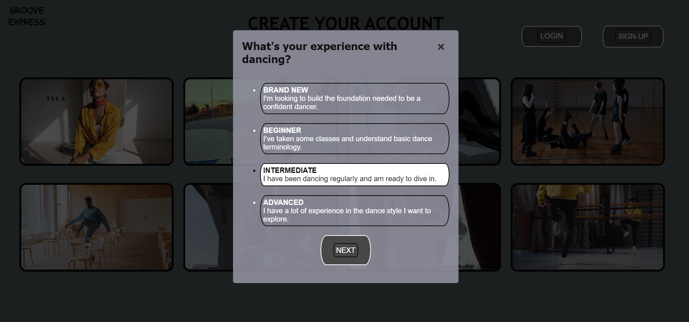
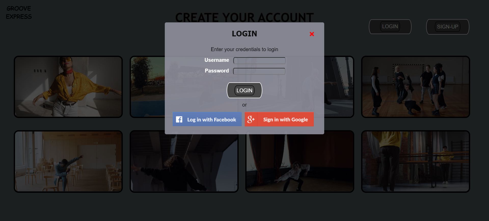

# Front-end_Dev

This is a project showing a front-end design example of a website based on the theme of a dance studio. Different css and javascript effects have been used to describe the programs and features offered by the studio. All different sections of the main page (programs, features, styles, instructors, pricing) and the second page have unique styles and effects.

<h3>FEW SECTIONS FROM THE MAIN PAGE</h3>

<h4>STYLES SECTION</h4>

<h4>PRICING SECTION</h4>

<h4>INSTRUCTORS SECTION</h4>

 
<h3>FEW SECTIONS FROM THE SECOND PAGE</h3>
<h4>CREATE YOUR ACCOUNT</h4>

<h4>BASIC QUESTIONS FOR PERSONALISED FEED</h4>

<h4>SIGN UP</h4>

